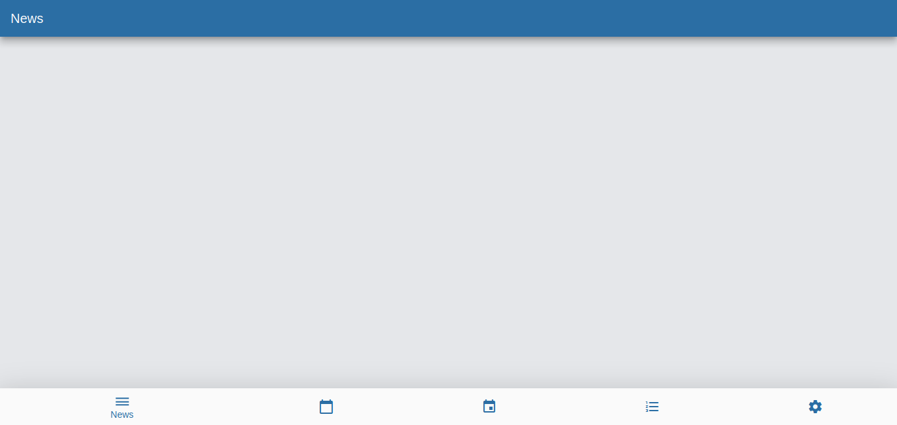

## hltv
<!-- PROJECT SHIELDS -->
![Flutter][flutter-shield]
![Android][android-shield]
![Apple][apple-shield]


<p align="center">:bangbang: Project available to access at: https://nitaicharan.github.io/hltv :bangbang:</p>

<!--[](https://nitaicharan.github.io/hltv/)-->
<a href="https://nitaicharan.github.io/hltv">
  <p align="center">
    
  </p>
</a>

## About course
:books: This is a personal project study about Google’s UI toolkit for building applications Flutter.

## Contact
[![Gmail][gmail-shield]][gmail-url]
[![LinkedIn][linkedin-shield]][linkedin-url]
[![Github][github-shield]][github-url]
[![Udemy][udemy-shield]][udemy-url]
[![Instagram][instagram-shield]][instagram-url]
[![Twitter][twitter-shield]][twitter-url]

## Development GitHub Pages
```
flutter build web
cp build/web/index.html build/web/404.html

git add -A
git commit -m <titule> <message>
git push origin <branch>
git subtree push --prefix build/web origin gh-pages
git push origin `git subtree split --prefix build/web/ master`:gh-pages --force
```

<!-- MARKDOWN LINKS & IMAGES -->
<!-- https://www.markdownguide.org/basic-syntax/#reference-style-links -->

<!-- ALIES README -->
[course-url]: https://udemy.com/course/flutter-bootcamp-with-dart/
[instructor-url]: https://udemy.com/user/4b4368a3-b5c8-4529-aa65-2056ec31f37e/
[certificate-url]: https://ude.my/UC-9063G6AV


<!-- CONTACT SHIELDS -->
[linkedin-shield]: https://img.shields.io/badge/-LinkedIn-white.svg?logo=linkedin&colorB=0077B5&logoColor=white
[linkedin-url]: https://linkedin.com/in/nitaicharan/
[gmail-shield]: https://img.shields.io/badge/-Gmail-black.svg?logo=gmail&colorB=D14836&logoColor=white
[gmail-url]: mailto:niaicharan@gmail.com?subject=It%20comes%20from%20Github%20profile
[github-shield]: https://img.shields.io/badge/-Github-black.svg?logo=github&colorB=181717&logoColor=white
[github-url]: https://github.com/nitaicharan
[instagram-shield]: https://img.shields.io/badge/-Instagram-black.svg?logo=instagram&colorB=EC5252&logoColor=white
[instagram-url]: https://instagram.com/nitaicharan/?hl=pt-br
[twitter-shield]: https://img.shields.io/badge/-Twitter-black.svg?logo=twitter&colorB=1DA1F2&logoColor=white
[twitter-url]: https://twitter.com/nitaicharan1
[facebook-shield]: https://img.shields.io/badge/-Facebook-black.svg?logo=facebook&colorB=4172B8&logoColor=white
[facebook-url]: https://facebook.com/NitaiCharan1
[udemy-shield]: https://img.shields.io/badge/-Udemy-black.svg?logo=udemy&colorB=EC5252&logoColor=white
[udemy-url]: https://udemy.com/user/nitai-charan/
[hackerrank-shield]: https://img.shields.io/badge/-HackerRank-white.svg?logo=hackerrank&colorB=2EC866&logoColor=white
[hackerrank-url]: https://www.hackerrank.com/nitaicharan

<!-- PROJECT SHIELDS -->
[html5-shield]: https://img.shields.io/badge/-HTML5-black.svg?logo=html5&colorB=E34F26&logoColor=white
[css3-shield]: https://img.shields.io/badge/-CSS3-black.svg?logo=css3&colorB=1572B6&logoColor=white
[sass-shield]: https://img.shields.io/badge/-SASS-black.svg?logo=sass&colorB=CC6699&logoColor=white
[angular-shield]: https://img.shields.io/badge/-Angular-black.svg?logo=angular&colorB=DD0031&logoColor=white
[java-shield]: https://img.shields.io/badge/-Java-black.svg?logoColor=white&logo=java&&colorB=007396
[javascript-shield]: https://img.shields.io/badge/-JavaScript-black.svg?logoColor=white&logo=javascript&&colorB=F7DF1E
[typescript-shield]: https://img.shields.io/badge/-TypeScript-black.svg?logoColor=white&logo=typescript&&colorB=007ACC
[react-shield]: https://img.shields.io/badge/-React-black.svg?logoColor=white&logo=react&colorB=61DAFB
[jquery-shield]: https://img.shields.io/badge/-jQuery-white.svg?logo=jquery&colorB=0769AD&logoColor=white
[spring-shield]: https://img.shields.io/badge/-Spring-white.svg?logo=spring&colorB=6DB33F&logoColor=white
[flutter-shield]: https://img.shields.io/badge/-Flutter-white.svg?logo=flutter&logoColor=white&colorB=02569B
[android-shield]: https://img.shields.io/badge/-Android-white.svg?logo=android&logoColor=white&colorB=3DDC84
[apple-shield]: https://img.shields.io/badge/-Apple-white.svg?logo=apple&logoColor=white&colorB=999999